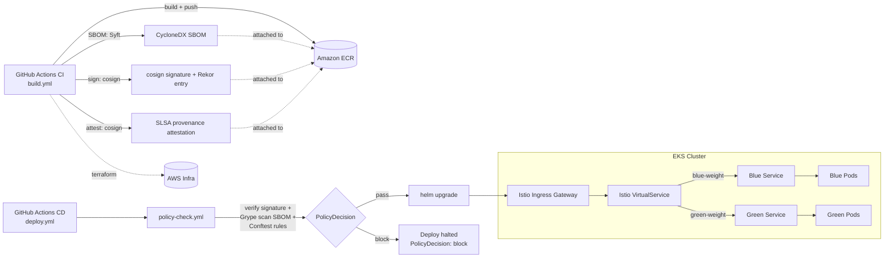

# Governed Golden Path: An Agent-Operable EKS Delivery Platform

A working reference platform showing how a blue/green EKS deployment
pipeline becomes agent-operable and policy-governed: supply-chain
attestation (SLSA/SBOM), policy-as-code gates, an MCP server exposing
deployment operations as agent tools, and a local knowledge graph that
grounds agent answers in real system state instead of model guesswork.

This is a reference/demo pattern, not a claim of production-scale
operation — see `docs/architecture-v2.md` for the honest scope, and
`docs/demo-script.md` for a rehearsable end-to-end walkthrough.

- **Supply chain** — every image is SBOM'd, signed, and attested before it's
  allowed to deploy: [`policy/README.md`](policy/README.md)
- **Agent interface** — pipeline/deployment state exposed as MCP tools:
  [`mcp-server/README.md`](mcp-server/README.md)
- **Grounded answers** — a knowledge graph an agent must query, including
  facts no model could hallucinate: [`graph/schema.md`](graph/schema.md)
- **The story connecting all three**: [`docs/architecture-v2.md`](docs/architecture-v2.md)

Everything below this point is the underlying blue/green EKS reference this
platform is built on — the app, Helm chart, and Terraform are unmodified;
the pipeline diagrams below are updated to show where the new signing and
policy gates sit in the flow.

---

# Jamal's Socks: EKS Blue-Green/Canary Demo


```
+-------------------+     +----------------------------+     +----------------------+
| GitHub Actions CI  +---->| sign + SBOM + attest        +---->|   Amazon ECR         |
|   (build.yml)      |     | (cosign, Syft, provenance)  |     +----------------------+
+-------------------+     +----------------------------+

              (signed, SBOM'd, attested image available in ECR)

+-------------------+     +----------------------------+
| GitHub Actions CD  +---->| policy-check.yml            |
|   (deploy.yml)     |     | verify signature + Grype    |
+-------------------+     | scan SBOM + Conftest rules   |
                          +--------------+---------------+
                                         |
                              PASS      |      BLOCK
                               v        v
                 +---------------------+   +--------------------------+
                 | helm upgrade        |   | deploy halted            |
                 | Istio traffic shift |   | PolicyDecision: block    |
                 +----------+----------+   +--------------------------+
                            v
                +-------------------------------------------------------------+
                |                    EKS Cluster                             |
                |   +-------------------+    +-------------------+           |
                |   | Blue Service      |    | Green Service     |           |
                |   |  (Pods)          |    |  (Pods)           |           |
                |   +-------------------+    +-------------------+           |
                +-------------------------------------------------------------+
```

<details>
<summary>Click to view text-based diagram (Mermaid)</summary>



</details>

See `docs/architecture-v2.md` for how the MCP server and knowledge graph
connect to a `PolicyDecision` on either side of that gate.

---

## 🚀 What This Sample Does

- **Node.js Express app**: Simple API, versioned, shows traffic split visually.
- **Blue/Green Deployments**: Two versions (blue/green) run side-by-side.
- **Istio Traffic Shifting**: Canary rollout by percentage (0-100%) using Istio VirtualService.
- **Helm Chart**: All deployment config (traffic, versions, resources) in `helm/sock-app/values.yaml`.
- **Terraform IaC**: Provisions EKS, VPC, ECR, IAM, OIDC, and all infra in `iac/`.
- **GitHub Actions CI/CD**: Three workflows:
  - `build.yml`: Build/push Docker images, auto-increment version.
  - `deploy.yml`: Deploy to EKS via Helm, set traffic split and versions.
  - `terraform.yml`: Provision/destroy infra with approval.

---

## 🏗️ Infrastructure as Code (iac/)

- **main.tf**: Provisions VPC, EKS cluster, node group, ECR repo, IAM roles, OIDC provider.
- **Outputs**: Kubeconfig, ECR URL, and IAM role for GitHub Actions.
- **Destroy**: Run `terraform destroy` (manually or via workflow) to tear down all resources.

**Trigger via GitHub Actions:**
1. Go to Actions → Terraform Infrastructure → Run workflow.
2. Choose `plan`, `apply`, or `destroy`.
3. For `apply`/`destroy`, set `auto_approve: true` to skip manual approval.

---

## 🐳 Helm Chart (helm/sock-app/)

- **Purpose**: Declarative deployment of blue/green app, Istio config, resource limits, and service.
- **Key values in `values.yaml`:**
  - `traffic.blue.weight` / `traffic.green.weight`: % of traffic to each version (must total 100)
  - `traffic.blue.version` / `traffic.green.version`: App versions (e.g., "1.3", "1.2")
  - `resources`: CPU/memory requests/limits for pods
  - `service.targetPort`: App port (default 8080)
- **How Helm works here:**
  - Templatizes Kubernetes manifests for blue/green deployments
  - Applies Istio Gateway, VirtualService, and DestinationRule for traffic control
  - All config is reproducible and versioned

**Deploy manually:**
```bash
helm upgrade --install sock-app ./helm/sock-app \
  --set traffic.blue.weight=50 \
  --set traffic.green.weight=50 \
  --set traffic.blue.version=1.3 \
  --set traffic.green.version=1.2
```

---

## 🤖 GitHub Actions Workflows

### 1. `build.yml` (Build & Push Docker Image)
**Triggers:** Push to `main`/`develop`, PRs, or manual dispatch.
- Auto-increments version in `.version` file
- Builds Docker image with version, SHA, and `latest` tags
- Pushes to ECR

### 2. `deploy.yml` (Deploy to EKS with Helm)
**Triggers:** Manual dispatch (recommended), or after build.
- Prompts for:
  - `blue_weight` (0-100): % traffic to blue
  - `blue_version` (e.g., 1.3)
  - `green_version` (e.g., 1.2)
- Updates EKS via Helm with new traffic split and versions
- **Reminder:** Manually update `values.yaml` to match deployed state for code clarity

### 3. `terraform.yml` (Infra Provision/Destroy)
**Triggers:** Manual dispatch or push to `iac/`
- Prompts for:
  - `action`: `plan`, `apply`, or `destroy`
  - `auto_approve`: true/false
- Provisions or destroys all AWS infra

### 4. `policy-check.yml` (Policy Gate — SBOM / Signature / CVE)
**Triggers:** Called as a job from `deploy.yml`, before the Helm deploy step.
- Verifies the target image's cosign signature and pulls its SBOM
- Scans the SBOM for CVEs with Grype and evaluates `policy/rules/*.rego` with Conftest
- Writes a structured `PolicyDecision` JSON artifact and blocks the deploy job on a `block` verdict
- See [`policy/README.md`](policy/README.md) for the full policy contract

### 5. `secret-scan.yml` (Compliance Gate — Committed Secrets)
**Triggers:** Every push, every PR to `main`, a weekly full-history sweep, and as a required job in `build.yml`.
- Scans the full commit history (not just the tip) with [Gitleaks](https://github.com/gitleaks/gitleaks) for private keys, cloud credentials, and tokens
- Uploads findings to this repo's Security → Code scanning tab (SARIF), plus a workflow artifact
- `build.yml` won't build an image from a commit this fails on

---

## 🔒 Golden Path: Signed, Attested, Policy-Gated by Default

`build.yml` now generates a CycloneDX SBOM with Syft, signs every image
keylessly with cosign (GitHub OIDC identity, logged in Rekor), and attaches a
SLSA-style provenance attestation — and won't even run unless `secret-scan.yml`
confirms the commit is clean of committed secrets first. `deploy.yml` then
cannot reach the Helm deploy step until `policy-check.yml` confirms that
signature and CVE posture pass `policy/rules/*.rego`. None of this is a
one-off check bolted onto this one repo: it's the paved road. Any team that
forks this pattern inherits signed builds, SBOMs, a secret-scanning gate, and
a policy gate for free, without having to design or remember to add any of it
themselves — the pipeline simply won't ship an
image that skips it.

---

## 🔀 How to Shift Traffic (Canary/Blue-Green)

1. **Run Deploy Workflow:**
	- Go to Actions → Deploy to EKS with Helm → Run workflow
	- Set `blue_weight` (e.g., 10, 50, 100)
	- Set `blue_version` and `green_version` as needed
2. **Observe:**
	- Gateway URL is printed in workflow output
	- App UI shows version and traffic split
3. **Manual Sync:**
	- Edit `helm/sock-app/values.yaml` to match deployed weights/versions for future reference

---

## 📝 Required Inputs & Secrets

### GitHub Secrets (Settings → Secrets → Actions):
- `AWS_ROLE_ARN`: OIDC-enabled IAM role for GitHub Actions
- `ECR_REGISTRY`: Your ECR registry URL (e.g., `801507307735.dkr.ecr.us-east-1.amazonaws.com`)

### Optional Repository Variables:
- `AWS_REGION`: (default: us-east-1)
- `EKS_CLUSTER_NAME`: (default: octopus-eks-demo)
- `ECR_REPOSITORY`: (default: octopus-eks-demo-app)

---

## 📦 Project Structure

- `app/` - Node.js Express app (shows version, health, etc.)
- `helm/sock-app/` - Helm chart for blue/green/canary deployment
- `iac/` - Terraform for all AWS infrastructure
- `scripts/` - Helper scripts (install Istio, Helm deploy, canary traffic)
- `.github/workflows/` - CI/CD pipelines (build, deploy, infra)

---

## 🧪 Sample App Details

- **Node.js Express**
- Listens on port 8080
- Shows version and traffic split visually
- Endpoints: `/`, `/health`, `/api/info`, `/api/status`, `/demo`
- Dockerfile supports build args for version and SHA

---

## 🛠️ How to Reproduce End-to-End

1. **Provision Infra:**
	- Run Terraform workflow (`apply`)
2. **Install Istio:**
	- `./scripts/install-istio.sh`
3. **Build & Push Image:**
	- Run Build workflow or push to `main`
4. **Deploy to EKS:**
	- Run Deploy workflow, set traffic split/versions
5. **Shift Traffic:**
	- Re-run Deploy workflow with new weights
6. **Destroy Infra:**
	- Run Terraform workflow (`destroy`)

---

## 📖 References

- [Istio Traffic Management](https://istio.io/latest/docs/tasks/traffic-management/)
- [Helm Docs](https://helm.sh/docs/)
- [Terraform AWS Provider](https://registry.terraform.io/providers/hashicorp/aws/latest/docs)

---

**Maintainer:** Jamal D. Waites
