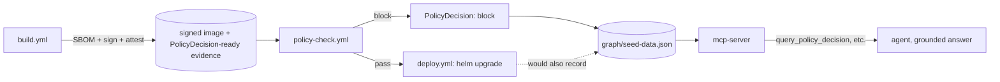

# Architecture: From Blue/Green Reference to Governed, Agent-Operable Platform

## Where this started

This repo began as a straightforward blue/green EKS reference: a Node.js app,
a Helm chart driving traffic split between two versions via Istio, Terraform
provisioning the cluster, and GitHub Actions building/pushing images and
running `helm upgrade` on demand. It worked, and it's still the foundation —
nothing in `app/`, `helm/sock-app/`, or `iac/` changed to build what's
described below.

What it didn't have: any guarantee about *what* got deployed. `build.yml`
would happily push an unsigned image with unknown vulnerabilities, and
`deploy.yml` would happily ship it. Nothing checked, nothing recorded why a
deploy was allowed, and nothing but a human reading logs could answer "why
did this deploy happen" after the fact.

## The extension: three workstreams, one story

The rest of this repo (`policy/`, `.github/workflows/policy-check.yml`,
`mcp-server/`, `graph/`) extends the same pipeline with three things that
build on each other, not three disconnected demos bolted on side by side.

### 1. Supply-chain integrity turns "an image" into "a provable artifact"

`build.yml` won't even start building until `secret-scan.yml` confirms the
triggering commit is clean — Gitleaks scans full history (not just the diff)
on every push, every PR, and weekly, uploading findings to this repo's
Security tab rather than a log nobody reads. This is what actually surfaced
and let us remove 7 private keys that had been sitting in this repo's initial
commit since before Phase 1 started (Istio's own public sample certs, not a
real leak, but exactly the kind of thing this gate exists to catch when it
isn't).

`build.yml` also now generates a CycloneDX SBOM with Syft, signs the image
keylessly with cosign (the same GitHub OIDC identity the pipeline already
uses to authenticate to AWS — no new secret, no new trust boundary), and
attaches a SLSA-style provenance attestation describing exactly which commit,
workflow, and run produced it. Every image this pipeline builds now carries
its own evidence: what's in it (SBOM), who built it (signature), and how
(provenance). See `policy/README.md` for why the official
`slsa-github-generator` was traded for a documented simplified equivalent.

That evidence would be inert without a gate that reads it. `policy-check.yml`
verifies the signature, pulls the SBOM back down, scans it for CVEs with
Grype, and evaluates both against `policy/rules/*.rego` with Conftest —
before `deploy.yml` is allowed to run Helm. The output is a structured
`PolicyDecision` record: verdict, which rule fired, why, and the CVE counts
that triggered it. This isn't a lint warning; on our first live test run of
this pipeline, it genuinely blocked a real deploy (5 critical CVEs against a
3-CVE threshold) — see `docs/demo-script.md` step 2.

### 2. MCP turns the pipeline's state into something an agent can act on

A `PolicyDecision` record sitting in a workflow artifact is only useful to
whoever remembers to go look at GitHub Actions. `mcp-server/` exposes that
same state — deployment status, policy verdicts, CVEs, the whole
service-level picture — as MCP tools any agent can call:
`query_deployment_status`, `query_policy_decision`, `query_service_graph`,
`explain_last_deploy`, and one gated action tool, `shift_traffic`.

This is the "MCP as universal interface" bet: instead of building a bespoke
chatbot integration for this one pipeline, the pipeline's state is exposed
through a protocol any MCP-compatible agent already speaks. The same server
that answers a human's question in a chat client could back a Slack bot, a
CI dashboard, or another agent entirely, with zero pipeline-specific glue
code on the consuming side.

### 3. The knowledge graph is what makes "the agent knows" a testable claim

An agent that can call tools can still hallucinate the answer instead of
using them. The graph in `graph/` (schema in `graph/schema.md`, data in
`graph/seed-data.json`) exists specifically to make that failure mode
detectable: it mixes real data from this repo's actual pipeline runs with
facts that are *deliberately impossible for any base model to know* — a CVE
ID dated 2031, an approver name invented solely for this seed file. The real
entry isn't hand-typed either — `graph/ingest-policy-decision.mjs` parses an
actual `policy-decision.json` artifact from `policy-check.yml` directly into
the graph, field for field, so there's no manual transformation step between
"what the pipeline produced" and "what the agent can query." A
correct answer to "why was `dep-002-fictional-demo` blocked, and who needs to
approve it?" has to name both of those exact, unguessable facts. If it does,
that's proof the agent queried the graph. If it doesn't, that's proof it
didn't — either way, the claim is now testable instead of asserted.

`query_policy_decision` additionally logs and returns the raw graph payload
*before* any synthesized answer — so the evidence behind a claim is always
one step away, not hidden behind a summary. `CLAUDE.md`'s grounding
constraint (`you have no built-in knowledge of this system's ... state, you
must call the appropriate tool before answering`) is what makes calling the
tool mandatory rather than optional; without that constraint on the calling
agent, none of this is enforced.

## How the three compose

A deploy either goes through Helm or gets recorded as a blocked
`PolicyDecision` — either way, that outcome is what the graph holds and what
the MCP server serves. The agent's answer about "what happened and why" is
only ever as good as what actually happened in the pipeline, because that's
the only thing it's allowed to look at.

## Honest scope

This is a reference/demo pattern proving each mechanism works end-to-end, not
a claim of production-scale operation:

- The graph is a JSON file loaded in memory, not a running Neo4j instance —
  documented in `graph/schema.md` as a deliberate, swappable simplification.
- `shift_traffic` is simulated; it validates inputs and requires explicit
  confirmation but never calls real `helm upgrade` — see `mcp-server/README.md`.
- The SLSA provenance attestation is a documented simplified equivalent of
  `slsa-framework/slsa-github-generator`, not the official generator.
- Seed data currently covers one real pipeline run plus one constructed
  fixture, not a fleet of services — enough to prove the grounding pattern,
  not a claim of comprehensive operational history.

Every one of those is a scoping decision made explicitly, not a gap left
unlabeled — see each component's own README for the reasoning.
